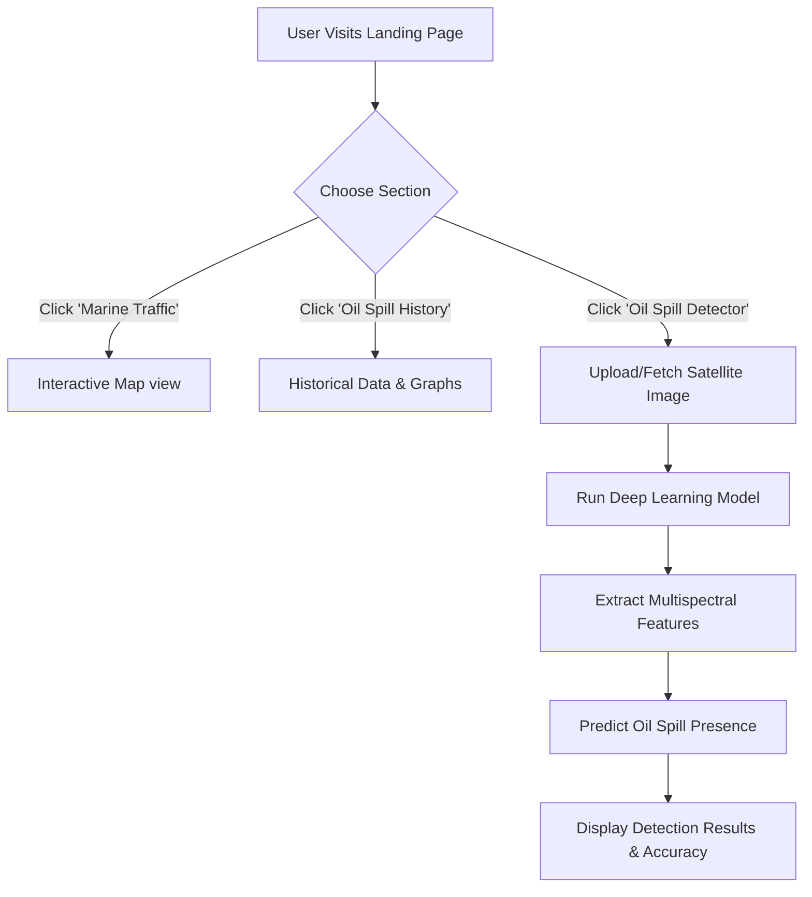

<<<<<<< HEAD
# 🌊 Marine Oil Spill Detection using Machine Learning

## 📌 Project Overview
Marine oil spills pose a serious threat to ocean ecosystems, coastal regions, and marine life. Early and accurate detection is critical to minimize environmental damage and enable rapid response.

This project presents a **machine learning–based system** for detecting marine oil spills using **satellite imagery** and **Automatic Identification System (AIS)** vessel data. By combining image processing techniques with classification models, the system aims to automatically identify oil spills and distinguish them from similar surface anomalies such as algal blooms or ship wakes.

---

## 🎯 Objectives
- Develop an automated oil spill detection system using machine learning  
- Utilize satellite imagery and AIS data for improved accuracy  
- Implement classification algorithms such as **SVM** and **Random Forest**  
- Enable real-time or near real-time oil spill monitoring  
- Support environmental agencies in faster decision-making and response  

---

## 🧠 Methodology

### 1. Data Collection
- **Satellite Imagery**: Sentinel-1, MODIS, Landsat  
- **AIS Data**: Vessel movement and activity tracking  

### 2. Data Preprocessing
- Image enhancement (noise reduction, contrast adjustment)
- Feature extraction (texture, shape, spectral features)
- Data normalization
- Handling missing AIS data

### 3. Machine Learning Models
- **Support Vector Machine (SVM)**
- **Random Forest**
- *(Optional)* CNN for advanced image recognition
- K-Means clustering for anomaly detection

### 4. Model Evaluation
- Train-test split (80% training, 20% testing)
- Metrics used:
  - Accuracy
  - Precision
  - Recall
  - F1-score
  - False Positive Rate

---

## 🏗️ System Architecture
1. **Input Layer** – Satellite images and AIS data  
2. **Preprocessing Layer** – Image cleaning and feature extraction  
3. **ML Processing Layer** – Oil spill classification  
4. **Visualization Layer** – GIS-based map output  
5. **Alert System** – Notification for detected oil spills  

---

## 🛠️ Technologies Used

### Programming Language
- Python

### Libraries & Frameworks
- TensorFlow
- Scikit-learn
- OpenCV
- NumPy
- Pandas
- Matplotlib

### Tools & Platforms
- Google Earth Engine
- GDAL
- PostgreSQL / PostGIS
- Jupyter Notebook / VS Code

---

## 💻 Hardware & Software Requirements

### Software
- Windows / Linux
- Python 3.x
- Google Earth Engine API
- Sentinel Hub API

### Hardware
- Intel Core i5 or higher
- Minimum 8GB RAM (16GB recommended)
- NVIDIA GPU (for deep learning models)
- At least 100GB storage

---

## 📊 Expected Outcomes
- Accurate and automated oil spill detection
- Reduced false positives
- Faster response time for authorities
- Cost-effective alternative to manual monitoring
- Scalable system for other marine pollution detection

---

## ⚠️ Limitations & Challenges
- Limited availability of labeled oil spill datasets
- High computational requirements for satellite data processing
- Difficulty in differentiating oil spills from similar surface anomalies
- Real-time processing constraints

---

## 🚀 Future Enhancements
- Integrate deep learning models (CNNs)
- Improve real-time detection performance
- Reduce false positives using additional environmental data
- Expand system to detect other marine pollutants like plastic waste

---

## 👨‍💻 Project Contributors
- **Afzal Khan**
- **Ram Chandra Gupta**
- **Prabhushankar C**

Bachelor of Technology  
Computer Science and Engineering  
Lovely Professional University, Punjab  

---

## 📚 References
- ESA Sentinel-1 SAR Data for Oil Spill Detection  
- NASA Earth Observatory – Marine Pollution Monitoring  
- Bishop, C. M. *Pattern Recognition and Machine Learning*  
- Research papers on ML-based oil spill detection  

---

## 📄 License
This project is developed for academic purposes under Lovely Professional University guidelines.
=======
<div align="center">
  <div style="background-color: #fff; display: inline-block; padding: 10px; border-radius: 50%;">
      
  </div>
  <h1 align="center">Marine Oil Spill Detection</h1>
  
  <p align="center">
    <strong>Monitor, analyze, and detect marine oil spills with cutting-edge technology and AI analytics.</strong>
    <br />
    <a href="https://github.com/afzalkhanofficial/Marine-Oil-Spill-Detection"><strong>Explore the docs »</strong></a>
    <br />
    <br />
    <a href="#">View Demo</a>
    ·
    <a href="https://github.com/afzalkhanofficial/Marine-Oil-Spill-Detection/issues">Report Bug</a>
    ·
    <a href="https://github.com/afzalkhanofficial/Marine-Oil-Spill-Detection/issues">Request Feature</a>
  </p>
</div>

<!-- Badges -->
<div align="center">
  
  
  
  
  
  
</div>

<!-- Contributors -->
<div align="center">
  <h3>✨Contributors</h3>
  <table style="border: none;">
    <tr style="border: none;">
      <td align="center" style="border: none;">
        <a href="#">
          
        </a>
        <br />
        <strong>Afzal Khan</strong>
      </td>
      <td align="center" style="border: none;">
        <a href="#">
          
        </a>
        <br />
        <strong>Ram Chandra G.</strong>
      </td>
      <td align="center" style="border: none;">
        <a href="#">
          
        </a>
        <br />
        <strong>Prabhushanker C</strong>
      </td>
    </tr>
  </table>
</div>

---

## 📖 About The Project

**Marine Oil Spill Detection** is an advanced environmental monitoring system designed to protect marine ecosystems. Oil spills destroy marine habitats and affect over 800 species annually. Our system combines satellite imagery, AI analysis, and real-time monitoring to combat oil pollution effectively.

Our mission is to provide early spill detection within 2 hours of occurrence with high accuracy, enabling rapid response and historical data analysis for prevention strategies.

### ✨ Key Features

* **Interactive Map:** Visualize current marine traffic and past oil spill events on a dynamic, interactive map powered by Leaflet.js.
* **Historical Data:** Analyze trends with detailed historical graphs to enhance prevention strategies.
* **AI Image Detection:** Employ Deep Learning models (TensorFlow/Keras) trained on satellite imagery to detect potential oil spills with up to 95% accuracy.
* **Real-time Monitoring:** 24/7 monitoring capabilities utilizing Earth observation satellites like Sentinel-2.
* **Intelligent Infrastructure:** Uses scalable cloud infrastructure and geospatial analysis to process and render multispectral data.

---

## 🛠️ Built With

* [HTML5 & CSS3](https://developer.mozilla.org/en-US/docs/Web/Guide/HTML/HTML5)
* [Tailwind CSS](https://tailwindcss.com/)
* [JavaScript](https://developer.mozilla.org/en-US/docs/Web/JavaScript)
* [Python & Flask](https://palletsprojects.com/p/flask/)
* [TensorFlow & OpenCV](https://www.tensorflow.org/)
* [Leaflet.js & GeoPandas](https://leafletjs.com/)

---

## 🚀 User Flow



---

## 💻 Getting Started

This project consists of an interactive front-end that connects to a Python-based intelligent backend for real-time AI processing.

### Prerequisites

You simply need a modern web browser and Python 3.x installed on your local machine for full functionality.

### Installation

1. Clone the repo
   ```sh
   git clone https://github.com/afzalkhanofficial/Marine-Oil-Spill-Detection.git
   ```
2. Navigate to the project directory
   ```sh
   cd Marine-Oil-Spill-Detection
   ```
3. Open `index.html` in your browser, or start a local server:
   ```sh
   # If you use Node.js
   npx serve .
   
   # Or using Python's built-in server
   python -m http.server 8000
   ```
4. Access the app by navigating to `http://localhost:8000` (or `http://localhost:3000` for `serve`).

---

## 📜 License

Distributed under the MIT License. See `LICENSE` for more information.

<div align="center">
  <br />
  Made with 💙 by the <b>Marine Oil Spill Detection</b> team
</div>
>>>>>>> 938ae85 (Initial commit)
