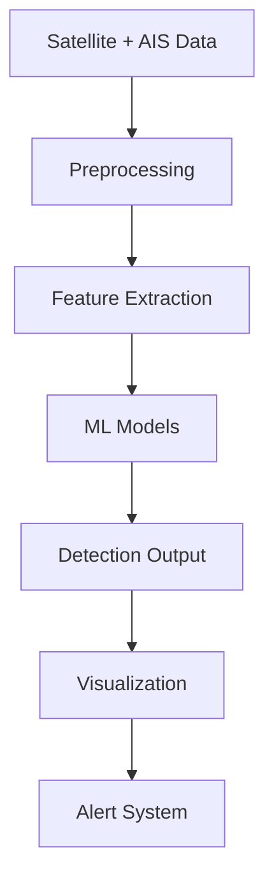
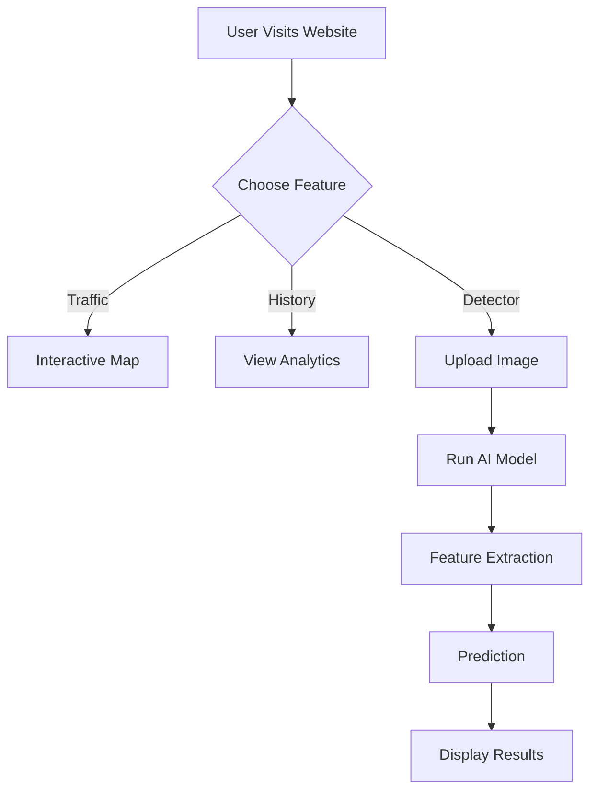

<div align="center">
  <div style="background-color: #fff; display: inline-block; padding: 10px; border-radius: 50%;">
      
  </div>
  <h1 align="center">🌊 Marine Oil Spill Detection</h1>

  <p align="center">
    <strong>Monitor, analyze, and detect marine oil spills with cutting-edge technology and AI analytics.</strong>
    <br /><br />
    <a href="https://oil-spill-detection-nine.vercel.app/detector.html"><strong>🚀 View Live Demo</strong></a>
    ·
    <a href="https://github.com/Chandra142/Oil-Spill-Detection"><strong>📂 Repository</strong></a>
    ·
    <a href="https://github.com/Chandra142/Oil-Spill-Detection/issues">🐛 Report Bug</a>
    ·
    <a href="https://github.com/Chandra142/Oil-Spill-Detection/issues">💡 Request Feature</a>
  </p>
</div>

---

<!-- Badges -->

<div align="center">
  
  
  
  
  
  
</div>

---

<!-- Contributors -->

<div align="center">
  <h3>✨ Contributors</h3>
  <table>
    <tr>
      <td align="center">
        
        <br />
        <strong>Afzal Khan</strong>
      </td>
      <td align="center">
        
        <br />
        <strong>Ram Chandra Gupta</strong>
      </td>
      <td align="center">
        
        <br />
        <strong>Prabhushanker C</strong>
      </td>
    </tr>
  </table>
</div>

---

## 📖 About The Project

Marine Oil Spill Detection is an advanced environmental monitoring system designed to protect marine ecosystems. Oil spills destroy marine habitats and affect over **800 species annually**.

This system combines:

* 🛰️ Satellite imagery (Sentinel, MODIS, Landsat)
* 🤖 Machine Learning models (SVM, Random Forest)
* 🌍 Real-time monitoring & geospatial analytics

### 🎯 Mission

* Detect oil spills within **2 hours**
* Achieve up to **95% accuracy**
* Provide historical insights for prevention

---

## ✨ Key Features

* 🗺️ **Interactive Map** – Visualize marine traffic & oil spills
* 📊 **Historical Data Analysis** – Explore trends
* 🤖 **AI-Based Detection** – ML-powered classification
* ⏱️ **24/7 Monitoring** – Continuous tracking
* ☁️ **Cloud Infrastructure** – Scalable processing

---

## 🧠 Methodology

### 1️⃣ Data Collection

* Satellite imagery (Sentinel-1, MODIS, Landsat)
* AIS vessel tracking data

### 2️⃣ Data Preprocessing

* Noise reduction
* Feature extraction (texture, shape, spectral)
* Normalization

### 3️⃣ Machine Learning Models

* Support Vector Machine (SVM)
* Random Forest
* (Optional) CNN
* K-Means clustering

### 4️⃣ Model Evaluation

* Accuracy
* Precision
* Recall
* F1-score

---

## 🏗️ System Architecture



---

## 🔄 User Flow



---

## 🛠️ Tech Stack

### 💻 Languages

* Python
* JavaScript

### 📚 Libraries

* TensorFlow
* Scikit-learn
* OpenCV
* NumPy
* Pandas

### 🌍 Tools

* Leaflet.js
* GeoPandas
* PostGIS
* Google Earth Engine

---

## 🚀 Live Demo

👉 https://oil-spill-detection-nine.vercel.app/detector.html

---

## 💻 Getting Started

```bash
git clone https://github.com/Chandra142/Oil-Spill-Detection.git
cd Oil-Spill-Detection
```

Run locally:

```bash
npx serve .
# OR
python -m http.server 8000
```

---

## 📊 Expected Outcomes

* Automated oil spill detection
* Reduced false positives
* Faster environmental response
* Scalable monitoring system

---

## ⚠️ Limitations

* Limited labeled datasets
* High computational cost
* Real-time constraints

---

## 🚀 Future Enhancements

* Deep Learning models (CNN)
* Real-time API integration
* Mobile application
* Alert systems (SMS/Email)

---

## 📚 References

* ESA Sentinel Data
* NASA Earth Observatory
* ML Research Papers

---

## 📄 License

This project is developed for **academic purposes**.

---

<div align="center">
  ⭐ Star the repo if you like it  
  <br /><br />
  💙 Made with passion for protecting oceans
</div>
